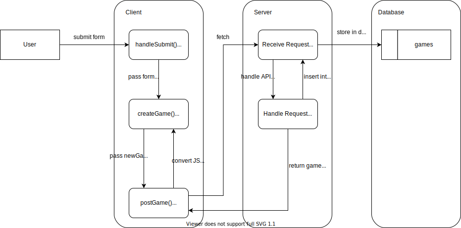

# Homework: Full Stack Games Hub App

## MVP

### Task

Draw a diagram showing the dataflow through the application starting with a form submission, ending with the re-rendering of the page. This will involve a multi-direction data-flow with the client posting data to the server and the server sending data back to the client with the response. Detail the client, server and database in the diagram and include the names of the files involved in the process.

### Questions

1. What is responsible for defining the routes of the `games` resource?

Answer

The routes of the `games` resource are defined by the helper function `createRouter` in `server/helpers/create_router.js` which creates routes prepended by `/api/games`.

2. What do you notice about the folder structure?  Whats the client responsible for? Whats the server responsible for?

Answer

The client is responsible for providing the user interface and making requests to the server. The server is responsible listening for requests from the client, amending the database as necessary, and providing a response to the client.

3. What are the the responsibilities of server.js?

Answer

`server.js` is responsible for connecting to the database, listening for API requests, amending the database, and providing a response to the client.

4. What are the responsibilities of the `gamesRouter`?

Answer

`gamesRouter` is responsible for providing RESTful API routes prepended by `/api/games` to provide CRUD functionality.

5. What process does the the client (front-end) use to communicate with the server?

Answer

The client uses `GamesService` process to communicate with the server via the `fetch` method.

6. What optional second argument does the `fetch` method take? And what is it used for in this application? Hint: See [Using Fetch](https://developer.mozilla.org/en-US/docs/Web/API/Fetch_API/Using_Fetch) on the MDN docs

Answer

The `fetch` method takes an optional second argument which is an `init` object which allows details of the HTTP request to be specified.

7. Which of the games API routes does the front-end application consume (i.e. make requests to)?

Answer

The client makes requests to `/api/games/ [GET]`, `/api/games [POST]`, and `/api/games/:id [DELETE]`.

8. What are we using the [MongoDB Driver](http://mongodb.github.io/node-mongodb-native/) for?

Answer

The MongoDB Driver is being used to connect to and interact with the database via javascript.

## Extension

Why do we need to use [`ObjectId`](https://mongodb.github.io/node-mongodb-native/api-bson-generated/objectid.html) from the MongoDB driver?

Answer

We need to use `ObjectId` from the MongoDB driver because the ID provided by MongoDB and stored on the key `_id` are instances of `ObjectId`. 

